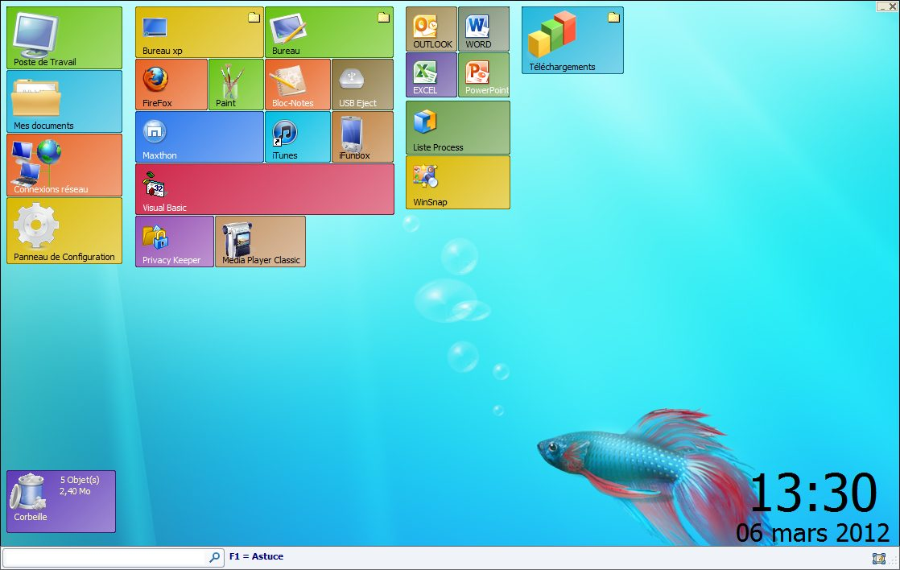



## Win 8 METRO

### Description

Win 8 METRO

Program like Winows 8 METRO interfaca but done using only VB6 (I love it) :)

you can personalize all thing, wallpaper, color, button style. by activating edition mode, you can drag button, resize it, use mouse to select many button at the same time (same style using in win 8 metro) ...etc

you'll find some greate fonction, you can learn some basic function and other more or less complicated (I do my best to make them simple)

you can also use the program to find some files/folders existing in desktop or in the start menu (use text search zone at the buttom on the left)

the source code IS NOT OPTIMIZED (i tell you), maybe i'll do it after) but the program work just fine

well, you can find more screenshot and some ICO file in my blog : http://mmvb2008.unblog.fr/ (under article Win 8 METRO)

(sorry, i forgot to translate form text from french to english)
 
### More Info
 

             |
---                |---
**Submitted On**   |2012-03-07 11:38:14
**By**             |[Simo Simo](https://github.com/Planet-Source-Code/PSCIndex/blob/master/ByAuthor/simo-simo.md)
**Level**          |Intermediate
**User Rating**    |4.9 (34 globes from 7 users)
**Compatibility**  |VB 6\.0
**Category**       |[Complete Applications](https://github.com/Planet-Source-Code/PSCIndex/blob/master/ByCategory/complete-applications__1-27.md)
**World**          |[Visual Basic](https://github.com/Planet-Source-Code/PSCIndex/blob/master/ByWorld/visual-basic.md)
**Archive File**   |[Win\_8\_METR222141382012\.zip](https://github.com/Planet-Source-Code/simo-simo-win-8-metro__1-74303/archive/master.zip)

